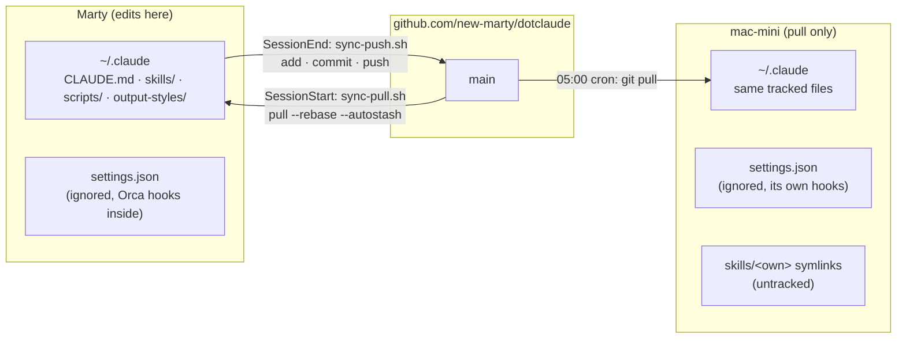
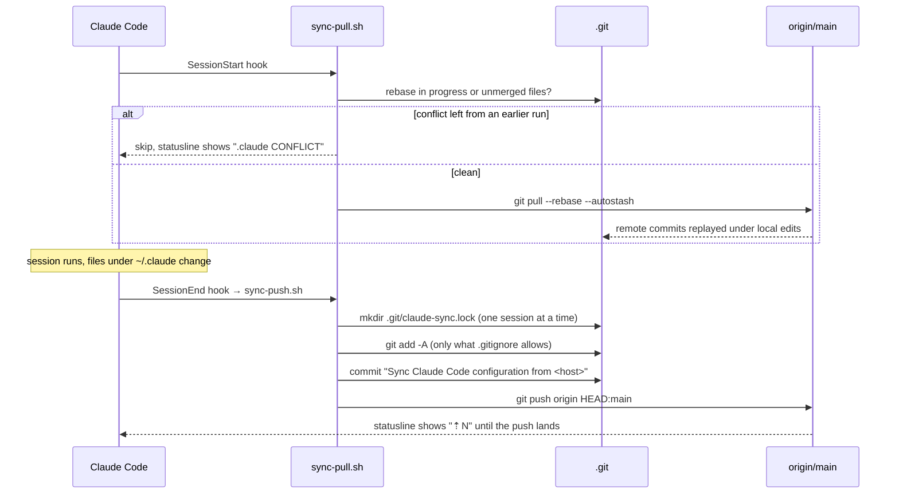

# dotclaude

`~/.claude` is a git repository. Every machine that runs Claude Code pulls it when a
session starts, and the machine you edit on pushes it when the session ends. Nothing else
is needed to keep instructions, skills and output styles identical everywhere.

The same directory is also where Claude Code dumps conversation logs, caches and OAuth
tokens. Those never enter the repository: `.gitignore` starts with `*` and then names the
handful of files that are configuration.

## Eight paths travel between machines; `settings.json` stays home

| Path | Contents |
| --- | --- |
| `CLAUDE.md` | Instructions applied to every project |
| `skills/` | Skills, all prefixed `z-` |
| `output-styles/` | How answers are written |
| `scripts/` | What the hooks run |
| `statusline.sh` | The statusline |
| `settings.example.json` | Where a new machine's `settings.json` starts from |
| `ADOPTIONS.md` | What was taken from other repositories, and what was declined |
| `THIRD_PARTY_NOTICES.md` | Upstream licenses for the adopted files |

`settings.json` is the file Claude Code actually reads, and it is not tracked. On the
machine where Orca runs, Orca writes thirteen hooks into it; the headless Mac mini runs
hooks of its own and pulls on a cron schedule instead of a session hook. A month of
syncing the file produced conflicts and nothing else, so since 2026-09-26 each machine
keeps its own copy and a new machine copies `settings.example.json` once. A hook or
permission that every machine should have goes into the example file and is copied over
by hand.

Two more things live under `skills/` without being tracked. Orca symlinks four of its own
skills there (`computer-use`, `find-skills`, `orca-cli`, `orchestration`), and claude.ai
syncs a bundle into `skills/synced/` and moves deleted skills into `skills/.trash/`. Both
are per machine, both are ignored. The Mac mini also keeps six skills of its own under
`skills/` as untracked symlinks; `sync-push.sh` refuses to commit a directory with one of
those names, because a tracked copy would silently replace the symlink there.

To start tracking a new file, add a `!name` line to `.gitignore`; a directory needs
`!name/` and `!name/**`.

## Two hooks do all the syncing



`settings.example.json` registers `scripts/sync-pull.sh` on `SessionStart` and
`scripts/sync-push.sh` on `SessionEnd`, so a machine set up from it syncs from its first
session. A pull-only machine drops the `SessionEnd` hook and pulls whenever it likes.
The same file registers `scripts/handoff-inject.py` on `SessionStart`: when `z-wrap-up`
ended the previous session in this directory, the handoff it wrote comes back into
context for a week, so `/clear` costs nothing that was written down.

Within one session the two scripts do this:



The pull uses `--autostash`, so edits you made on this machine before the session are
shelved, the remote commits come in underneath, and the edits are put back on top. If
putting them back conflicts, the rebase stops there and both hooks refuse to touch the
repository until you resolve it (below).

The push takes a lock by creating a directory, because two sessions can end at the same
moment. The second one to arrive exits without committing; its changes wait for the next
session's push. A lock older than five minutes is treated as left over from a killed
session and taken over.

## The statusline is where you notice a stuck sync

`statusline.sh` draws up to four lines: account, model, directory and git on the first;
context usage on the second; the five-hour and seven-day usage limits on the third and
fourth. When usage cannot be fetched, on first launch or while the keychain is locked,
the last two lines are simply absent.

The first line names the account only when it is not the default. Under `~/work`,
`CLAUDE_SECURESTORAGE_CONFIG_DIR=~/.claude-work` is set and the line starts with
`work`. Claude Code stores each account's credentials under its own keychain service
name (`Claude Code-credentials-<tag>`, where `<tag>` is the first eight hex digits of the
SHA-256 of that directory's path), and the statusline derives the same name, so the usage
it shows is the signed-in account's. The cache under `/tmp/claude-usage-cache*.json` is
split the same way.

The end of the first line is the sync state, and it is empty when all is well. `.claude ⇡N`
means N commits have not reached GitHub: the SSH agent is locked, the network is down, or
the remote moved ahead. `⚠ .claude CONFLICT` means the last pull stopped on a conflict.

## A conflict stops both hooks until you resolve it by hand

```bash
git -C ~/.claude status          # which files
git -C ~/.claude diff            # which hunks
# edit, remove the markers
git -C ~/.claude add <file>
git -C ~/.claude rebase --continue
```

Your pre-pull state is also in `git -C ~/.claude stash list` if you want to compare.

## A new machine needs the bootstrap script and one copy

`chezmoi init --apply` on the (private) dotfiles repository runs its
`run_once_before_bootstrap-dotclaude.sh`, which turns the
existing `~/.claude` into this repository in place. A plain `git clone` fails because the
Claude Code installer has already created `~/.claude/downloads/` and friends. Files that
already exist are left alone; where they differ from the remote they show up in
`git status` for you to pick.

Then give the machine its `settings.json`:

```bash
cp -n ~/.claude/settings.example.json ~/.claude/settings.json
```

Skip this and no hook is registered, so the machine never syncs. By hand, the whole
bootstrap is:

```bash
mkdir -p ~/.claude && cd ~/.claude
git init -b main
git remote add origin git@github.com:new-marty/dotclaude.git
git fetch origin main
git branch -f main origin/main && git symbolic-ref HEAD refs/heads/main
git branch -u origin/main main
git reset origin/main
git checkout-index -a          # writes only the files that do not exist yet
cp -n settings.example.json settings.json
```

## Adopted skills say where they came from

A skill taken from another repository keeps its source URL and license in a comment at
the top of `SKILL.md`, and that comment says where upstream ends and local edits begin.
`ADOPTIONS.md` is the index over all of them, including the ones looked at and declined.
When you adopt or decline something, add the row there in the same commit.
