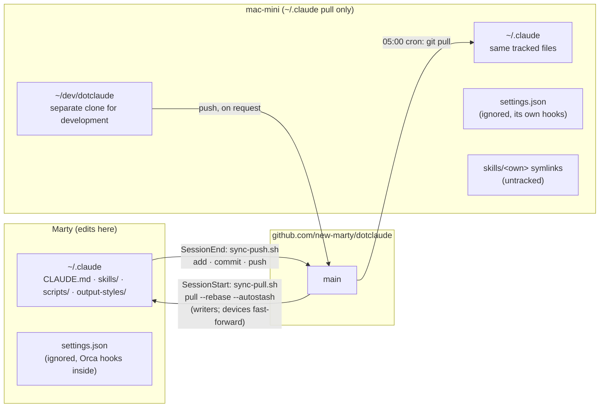

# dotclaude

`~/.claude` is a git repository. Every machine that runs Claude Code pulls it when a
session starts, and the machine you edit on pushes it when the session ends. Nothing else
is needed to keep instructions, skills and output styles identical everywhere.

The same directory is also where Claude Code dumps conversation logs, caches and OAuth
tokens. Those never enter the repository: `.gitignore` starts with `*` and then names the
handful of files that are configuration.

## Ten paths travel between machines; `settings.json` stays home

| Path | Contents |
| --- | --- |
| `CLAUDE.md` | Instructions applied to every project |
| `skills/` | Skills, prefixed `z-` except `browsing-web` |
| `output-styles/` | How answers are written |
| `scripts/` | What the hooks run, and the new-machine bootstrap |
| `statusline.sh` | The statusline |
| `settings.example.json` | Where a new machine's `settings.json` starts from |
| `ADOPTIONS.md` | What was taken from other repositories, and what was declined |
| `THIRD_PARTY_NOTICES.md` | Upstream licenses for the adopted files |
| `backlog/` | Tasks for this repository (Backlog.md) |
| `.claude-plugin/` | The manifests claude.ai reads to install `skills/` as a plugin |

`settings.json` is the file Claude Code actually reads, and it is not tracked. On the
machine where Orca runs, Orca writes thirteen hooks into it; the headless Mac mini runs
hooks of its own and pulls on a cron schedule instead of a session hook. A month of
syncing the file produced conflicts and nothing else, so since 2026-09-26 each machine
keeps its own copy and a new machine copies `settings.example.json` once. A hook or
permission that every machine should have goes into the example file and is copied over
by hand.

Two more things live under `skills/` without being tracked. Orca symlinks four of its own
skills there (`computer-use`, `find-skills`, `orca-cli`, `orchestration`), and claude.ai
syncs a bundle into `skills/synced/` and moves deleted skills into `skills/.trash/`. Both
are per machine, both are ignored. The Mac mini also keeps five skills of its own under
`skills/` as untracked symlinks (`adding-services`, `reading-x`, `recovering-gateway`,
`restoring-media-mount`, `tracking-tasks`). `.gitignore` lists those names, so
`sync-push.sh` never stages them and a pull never tracks them. They are part of the
device-local layer described in [Pull-only devices](#pull-only-devices).

To start tracking a new file, add a `!name` line to `.gitignore`; a directory needs
`!name/` and `!name/**`.

## Two hooks do all the syncing



`settings.example.json` registers `scripts/sync-pull.sh` on `SessionStart` and
`scripts/sync-push.sh` on `SessionEnd`, so a machine set up from it syncs from its first
session. A pull-only machine drops the `SessionEnd` hook and pulls whenever it likes;
see [Pull-only devices](#pull-only-devices).
The same file registers `scripts/handoff-inject.py` on `SessionStart`: when `z-wrap-up`
ended the previous session in this directory, the handoff it wrote comes back into
context for a week, so `/clear` costs nothing that was written down.

`scripts/check-upstream.sh` tells you when something we adopted has changed upstream. It reads the revisions we adopted from `scripts/upstream.tsv`, asks each upstream for its current head with `git ls-remote`, and prints `current` or `CHANGED` with a compare link. It exits 0 when all are current, 1 when any changed, 2 when a fetch failed. The mac-mini runs it every morning after its dotclaude pull and sends any `CHANGED` line to Telegram, again each morning until the list is updated; elsewhere, run it by hand. After re-reading a changed upstream, update its revision in the list.

The mac-mini's `~/.claude` only pulls. The mac-mini develops this repository in a separate
clone, `~/dev/dotclaude`, and pushes from there when asked; the `~/.claude` copy never
holds its edits. Marty's main machine pulls with the `SessionStart` hook and pushes with
the `SessionEnd` hook. Tasks for this repository live in `backlog/` (Backlog.md), not in
GitHub Issues.

Within one session the two scripts do this:

```mermaid
sequenceDiagram
    participant CC as Claude Code
    participant P as sync-pull.sh
    participant G as .git
    participant R as origin/main
    Note over P,R: writer path; a pull-only device fetches and fast-forwards instead
    CC->>P: SessionStart hook
    P->>G: rebase in progress or unmerged files?
    alt conflict left from an earlier run
        P-->>CC: skip, statusline shows ".claude CONFLICT"
    else clean
        P->>R: git pull --rebase --autostash
        R-->>G: remote commits replayed under local edits
    end
    Note over CC: session runs, files under ~/.claude change
    CC->>P: SessionEnd hook → sync-push.sh
    P->>G: mkdir .git/claude-sync.lock (one session at a time)
    P->>G: git add -A (only what .gitignore allows)
    P->>G: commit "Sync Claude Code configuration from <host>"
    P->>R: git fetch, rebase onto origin/main (abort on conflict)
    P->>R: git push origin HEAD:main
    R-->>CC: statusline shows "⇡N" until the push lands
```

The pull uses `--autostash`, so edits you made on this machine before the session are
shelved, the remote commits come in underneath, and the edits are put back on top. If
putting them back conflicts, the rebase stops there and both hooks refuse to touch the
repository until you resolve it (below). A pull-only device does not autostash; it only
fast-forwards (see [Pull-only devices](#pull-only-devices)).

The push takes a lock by creating a directory, because two sessions can end at the same
moment. The second one to arrive exits without committing; its changes wait for the next
session's push. A lock older than five minutes is treated as left over from a killed
session and taken over.

## The statusline is where you notice a stuck sync

`statusline.sh` draws up to four lines: account, model, directory and git on the first;
context usage on the second; the five-hour and seven-day usage limits on the third and
fourth. When usage cannot be fetched, on first launch or while the keychain is locked,
the last two lines are simply absent.

The usage limits belong to a claude.ai subscription, so they appear only there. A session
billed per token (Bedrock, Vertex, Foundry, an API key or an `apiKeyHelper`) starts the
first line with the provider and shows the session's estimated cost instead, plus the
spend limit when a gateway sets one. Claude Code does not tell the statusline which
billing path it is on, so the script follows Claude Code's
[authentication precedence](https://code.claude.com/docs/en/authentication#authentication-precedence),
and takes `rate_limits` in its input as proof of a subscription.

The first line names the account only when it is not the default. Under `~/work`,
`CLAUDE_SECURESTORAGE_CONFIG_DIR=~/.claude-work` is set and the line starts with
`work`. Claude Code stores each account's credentials under its own keychain service
name (`Claude Code-credentials-<tag>`, where `<tag>` is the first eight hex digits of the
SHA-256 of that directory's path), and the statusline derives the same name, so the usage
it shows is the signed-in account's. The cache under `/tmp/claude-usage-cache*.json` is
split the same way.

The end of the first line is the sync state, and it is empty when all is well. `.claude ⇡N`
means N commits have not reached GitHub: the SSH agent is locked, the network is down, or
the remote moved ahead. `⚠ .claude CONFLICT` means the last pull stopped on a conflict.
`⚠ .claude DIVERGED` means the last push found the other machine's commits and could not
rebase onto them without a conflict (or was rejected anyway); the rebase was aborted, the
commits are still local, and the marker `.git/claude-sync-diverged` stays until a push lands.
`sync-push.sh` also exits 2 then, which is how a SessionEnd hook gets its stderr shown.

## On a writer, a conflict stops both hooks until you resolve it by hand

This section is for writers. A pull-only device resolves conflicts as described under
[Pull-only devices](#pull-only-devices).

```bash
git -C ~/.claude status          # which files
git -C ~/.claude diff            # which hunks
# edit, remove the markers
git -C ~/.claude add <file>
git -C ~/.claude rebase --continue
```

Your pre-pull state is also in `git -C ~/.claude stash list` if you want to compare.

## Pull-only devices

A pull-only device is a machine whose `~/.claude` pulls this repository and never pushes:
the Mac mini, or a company Mac where hooks and scripts may be blocked. It keeps its own
instructions, skills and settings next to the shared ones, and a pull never overwrites them.

A device is marked by a git setting that lives in `.git/config`, so no pull touches it:

```bash
git -C ~/.claude config dotclaude.role pull-only
```

With the setting, `sync-push.sh` exits at once and `sync-pull.sh` only fast-forwards. A
machine without it is a writer and behaves as described above.

### The local layer

These paths are listed in `.gitignore` under "Device-local layer". Upstream never tracks them,
so a device may keep anything there:

| To | Create |
| --- | --- |
| add or override instructions | `~/.claude/CLAUDE.machine.md`, starting with "Where these rules conflict with the shared ones above, these win." Claude Code concatenates memory files and ranks none, so the text has to say it |
| add rules for some files only | `~/.claude/rules/<name>.md` with `paths:` frontmatter |
| add a skill | `~/.claude/skills/local-<name>/SKILL.md`, or a symlink at that path |
| add an output style | `~/.claude/output-styles/local-<name>.md` |
| hide a shared skill | `"skillOverrides": {"<name>": "off"}` in `~/.claude/settings.json`; only this string form works |
| use its own statusline | `~/.claude/statusline.local.sh`, set as `statusLine` in `settings.json` |

Keep device files at these paths only. A root-level file with any other name is ignored too,
but if upstream ever adds a file of that name, the pull overwrites the device's copy without
a word. Never `git add -f` a path in this list: the same overwrite happens in the other
direction. `scripts/test-sync-push.sh` fails if one of them becomes tracked or stops being
ignored. `CLAUDE.md` ends with `@~/.claude/CLAUDE.machine.md`, so the file loads when it
exists, and a missing one does not fail a session.

### Updating without local edits

The device stays on `main` and only fast-forwards. `sync-pull.sh` does this at session start
where hooks run; by hand:

```bash
git -C ~/.claude pull --ff-only
```

A fast-forward cannot conflict. If the device has changed a shared file, the pull refuses:
for an uncommitted change git names the file ("Your local changes to the following files
would be overwritten by merge"), for a commit on `main` it says only "Not possible to
fast-forward". Nothing is lost. `sync-pull.sh` then prints "pull failed" with git's output
and a line pointing here, and exits 0.

### Updating with local edits to shared files

A device that edits a shared file keeps the edit as a commit on a branch named `local`.
Once:

```bash
git -C ~/.claude switch -c local
git -C ~/.claude branch -u origin/main            # a new branch tracks nothing until told
git -C ~/.claude config merge.conflictStyle zdiff3
git -C ~/.claude commit -am "local: <what changed>"
git -C ~/.claude branch -D main                   # so `switch main` cannot hide the edits
```

Each update:

```bash
git -C ~/.claude status --short                   # commit any new edit first
git -C ~/.claude fetch
git -C ~/.claude merge origin/main
```

On any branch other than `main`, `sync-pull.sh` only fetches and tells you how many commits
you are behind; merging stays manual. When the merge stops:

- `CONFLICT (content)`: the file shows `<<<<<<< HEAD` (this device), `||||||| <hash>` (the
  common ancestor) and `>>>>>>> origin/main` (upstream). Edit to the wanted text,
  `git add <file>`, `git commit --no-edit`.
- `CONFLICT (modify/delete)`: `git rm <file>` takes upstream's deletion, `git add <file>`
  keeps the file; then `git commit --no-edit`.
- `git merge --abort` returns to the state before the update.

Commits on `local` use the device's git identity and signing settings. If company settings
require signing and the device has no key, those commits fail; signing with a device key, or
`git -C ~/.claude config commit.gpgsign false` for commits that never leave the device, is a
deliberate choice about company policy.

### Setting up a device

```bash
# A. No ~/.claude yet
git clone https://github.com/new-marty/dotclaude.git ~/.claude

# B. ~/.claude exists (Claude Code has run here): make it a clone, keep its old files aside
cd ~/.claude && git init -b main
git remote add origin https://github.com/new-marty/dotclaude.git && git fetch origin
git reset origin/main && git checkout-index -a
mkdir -p ~/claude-before
git diff -z --name-only | while IFS= read -r -d '' f; do
  mkdir -p ~/claude-before/"$(dirname "$f")" && cp -p "$f" ~/claude-before/"$f"
done
git restore . && cd -
#   Move what you want to keep from ~/claude-before into the local layer.
#   A skill of your own that shows as "?? skills/<name>/": rename it to skills/local-<name>.

# Then, for both:
git -C ~/.claude config dotclaude.role pull-only
git -C ~/.claude branch -u origin/main
cp -n ~/.claude/settings.example.json ~/.claude/settings.json
```

Then edit `settings.json`: remove the `SessionEnd` hook (it exits at once on a device anyway);
keep the `SessionStart` hook only if hooks are allowed; review `permissions.defaultMode`,
`skipDangerousModePermissionPrompt` and `skipAutoPermissionPrompt` against the company's rules.

Check after setup and after each update: `/context` lists `CLAUDE.machine.md` under memory
files, and `/skills` lists the shared skills and the `local-` ones.

### What the statusline shows on a device

`.claude ⇣N` means N upstream commits have not been merged, as of the last fetch (the
statusline makes no network call). On a branch other than `main` it also says `local`, as in
`.claude local ⇣2`. `⚠ .claude CONFLICT` still appears while a merge is unresolved;
`DIVERGED` and `⇡N` never appear, because nothing pushes.

### When it goes wrong

| What happens | What you see | What to do |
| --- | --- | --- |
| A device edits a shared file, then pulls with `--ff-only` | the pull refuses | the section on local edits |
| Upstream adds a file at a path a device uses without the `local-` prefix | "untracked working tree files would be overwritten" | rename the device's file to `local-...`, pull again |
| A device forgets to pull for weeks | `⇣N` after any fetch, nothing without one | `git fetch`; no reminder exists without hooks |
| The company blocks `~/.claude/skills` (`strictPluginOnlyCustomization`) | `/skills` lacks the shared skills, with no warning | out of scope; the plugin route (`claude plugin install dotclaude@dotclaude`) is untested, and carries no `CLAUDE.md` |
| A company `CLAUDE.md` contradicts the device's | Claude may follow either | nothing in dotclaude ranks them |

## Set up on a new machine

Install Claude Code first, then run:

```bash
curl -fsSL https://raw.githubusercontent.com/new-marty/dotclaude/main/scripts/bootstrap.sh | bash
cp -n ~/.claude/settings.example.json ~/.claude/settings.json
```

The repository is public, so the script downloads without signing in. The script
([`scripts/bootstrap.sh`](scripts/bootstrap.sh)) turns the existing `~/.claude` into this
repository in place. A plain `git clone` fails because the Claude Code installer has
already created `~/.claude/downloads/` and friends. Files that already exist are left
alone; where they differ from the remote they show up in `git status` for you to pick.
Running the script again does nothing once `origin/main` has been fetched, and a run whose
fetch failed can simply be repeated.

The script sets `origin` to the SSH URL, which a writer needs to push, so the machine must
already reach GitHub over SSH. On a machine without a GitHub SSH key, pass the HTTPS URL
instead:

```bash
curl -fsSL https://raw.githubusercontent.com/new-marty/dotclaude/main/scripts/bootstrap.sh \
  | DOTCLAUDE_REMOTE=https://github.com/new-marty/dotclaude.git bash
```

The `cp` line gives the machine its `settings.json`. Skip it and no hook is registered,
so the machine never syncs. A pull-only device follows
[Setting up a device](#setting-up-a-device) instead.

By hand, the whole bootstrap is:

```bash
mkdir -p ~/.claude && cd ~/.claude
git init -b main
git remote add origin git@github.com:new-marty/dotclaude.git
git fetch origin main
git branch -f main origin/main && git symbolic-ref HEAD refs/heads/main
git branch -u origin/main main
git reset origin/main
git checkout-index -a          # writes only the files that do not exist yet
cp -n settings.example.json settings.json
```

## claude.ai installs the skills as a plugin

`.claude-plugin/` holds two manifests that make this repository a plugin marketplace with
one plugin, `dotclaude`. The plugin's root is the repository root, so claude.ai finds the
skills in `skills/` and no file has to move. Add the repository once on claude.ai under
Customize > Plugins > Add > Add marketplace (the repository is public), and turn on Sync
automatically so that pushes to `main` reach the account.
[Plugins](https://claude.com/docs/plugins/overview) in the Claude docs has the steps.

Only `skills/` takes effect there. Chat on the web, in the desktop app and in the mobile
apps loads a plugin's skills and ignores its output styles and hooks, and `CLAUDE.md` is
not part of a plugin. A skill that tells Claude to follow `CLAUDE.md` therefore finds no
such rules in chat, and a skill that runs `gh`, `git` or a script under `~/.claude` cannot
do its work there.

A plugin installed on the account also comes back to Claude Code, on every machine signed
in to that account, as `dotclaude@synced`. That machine already loads the same skills from
`skills/`, so `settings.example.json` sets `"dotclaude@synced": false` under
`enabledPlugins` to keep the second copy from loading. A machine whose `settings.json` was
copied before that line existed needs it added by hand.

Edits travel one way. Change a skill in this repository and push; a change made on
claude.ai stays on claude.ai.

## Adopted skills say where they came from

A skill taken from another repository keeps its source URL and license in a comment at
the top of `SKILL.md`, and that comment says where upstream ends and local edits begin.
`ADOPTIONS.md` is the index over all of them, including the ones looked at and declined.
When you adopt or decline something, add the row there in the same commit.
