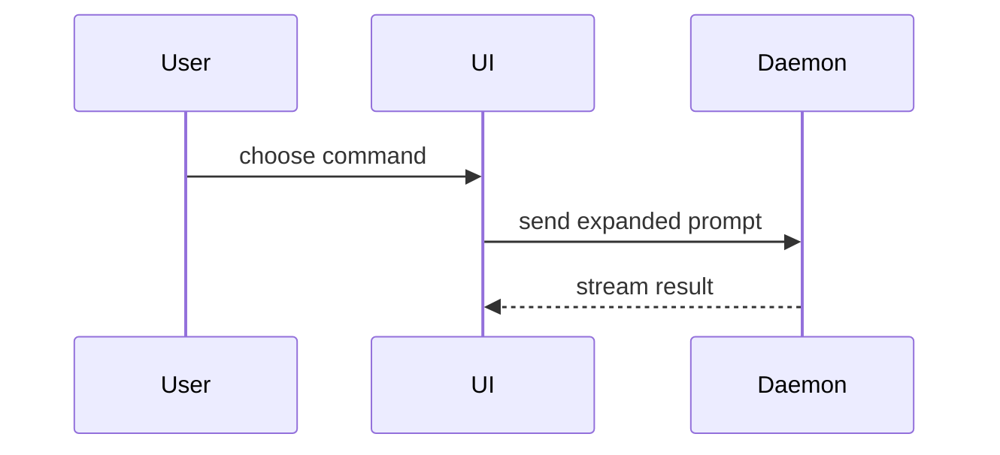

<!-- Vendored from https://github.com/humanlayer/skills/blob/main/plugins/show-me/skills/show-me/SKILL.md
     (MIT License, Copyright (c) 2026 HumanLayer). The body is upstream's except
     for the final bullet on HTML output, which is rewritten for this
     environment, and the "Handing it over in this environment" section, which is a local
     addition, as is the paragraph on Japanese output at its end. In the frontmatter,
     `name` is renamed to `z-show-me` and Japanese trigger phrases are appended to
     `description`. -->

Help the user understand the current topic of conversation visually. Skip the preamble and keep prose brief. Pick the smallest view that makes the key point clear.

- Show logic or an algorithm as pseudocode:

```text
on(save)
  if content is unchanged
    return cached result
  write new content
  return fresh result
```

- Show runtime control flow as a call tree:

```text
submitForm
  createSession
    persistPrompt
    launchAgent
  navigateToSession
```

- Show UI structure as a component tree, including state and module boundaries that matter:

```tsx
<SessionPage> (apps/example/src/routes/session.tsx)
  useSessionEvents()
  <SessionToolbar>
    <RunSkillButton> (packages/ui)
```

- Show file responsibility or a broad refactor as a shallow file tree:

```text
src/
├── commands/       # parses user actions
├── sessions/       # owns session state
└── transport/      # sends API requests
```

- Show component interaction, control flow, or data flow with Mermaid:



- Use `diff` when the point is what changes and the surrounding shape already exists. Match the diff shape to the topic.

For a component change:

```diff
 <SessionPage>
   useSessionEvents()
   <SessionToolbar>
+    <RunSkillButton />
   <SessionTimeline>
+    <SkillResultCard />
```

For a file-layout change:

```diff
 src/
 ├── commands/
+│   └── show-me.ts       # expands the slash command
 ├── sessions/
-└── transport.ts
+└── transport/
+    ├── client.ts
+    └── stream.ts
```

For a call-tree or call-stack change:

```diff
 submitForm
   createSession
     persistPrompt
+    expandSkillMention
     launchAgent
-  navigateToSession
+  navigateToSession
+    subscribeToEvents
```

For a state or control-flow change:

```diff
 on(save)
-  write content
+  if content is unchanged
+    return cached result
+  write new content
+  invalidate cache
```

- Show the whole block when most of it is new, when omitted context would hide ownership or order, or when the user needs a copyable target shape:

```ts
function expandSkill(command: string): string {
  const skillName = command.slice(1)
  return `use the ${skillName} skill`
}
```

- For a visual UI, layout, state comparison, or concept too dense for Mermaid, write one focused HTML file — a diagram, an infographic, or a short slide deck, whichever fits the point. Match the product's colors, type, spacing, and components; use real labels and data; support desktop and mobile. Then hand it to the user (see below).

### Handing it over in this environment

Once the HTML is written, do not open it with the `open` command. Hand it over one of two
ways.

- **The Artifact tool** — gives a shareable URL. Use it for a diagram with several readers,
  material to look back at later, or anything you want to pass as a link. Read the
  `artifact-design` skill first, and `artifact-diagramming` too if it contains diagrams.
- **The SendUserFile tool** — for a diagram shown once and done. Pass `display: "render"`.

Pseudocode, call trees, file trees, and diffs go straight into the reply, not into HTML.

Claude Code's TUI does not render mermaid, so convert it to ASCII before putting it in a
reply.

```sh
node ~/.claude/scripts/mermaid-term/render.mjs <<'EOF'
flowchart LR
    A[Start] --> B[Done]
EOF
```

Put that output in a `text` code block. The reader reads the diagram, so do not show the
mermaid source alongside it. It can draw flowcharts (including subgraphs),
sequenceDiagram, stateDiagram, classDiagram, and erDiagram. Full-width labels line up with
their boxes, but only because zero-width characters are mixed in, so the output is not
suited to being reused as code.

Subgraphs of differing heights placed side by side do overlap into an unreadable mess. To
place them side by side, give each subgraph the same height, or split the diagram. Always
look at the output before pasting it, and rewrite the diagram if it came out broken.

A diagram going into an Artifact is not converted. Written as mermaid, it renders in the
browser.

### guidance

Place each visual next to the short text it supports. Keep only the calls, files, props, states, and boundaries needed to answer the user's current question or the options to resolve the current discussion point.

You may use one of these, you may use several, it is unlikely you will use all of them. Use your judgement and don't overwhelm the user.

When the prose around a diagram is Japanese, it goes through `z-natural-japanese` (the
constitution before writing, `lint.py` on the draft) and then `z-japanese-proofreading`,
like any other Japanese text a person will read. The diagram labels count as prose.
